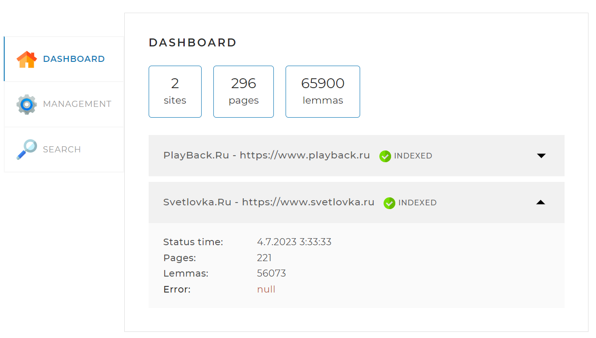
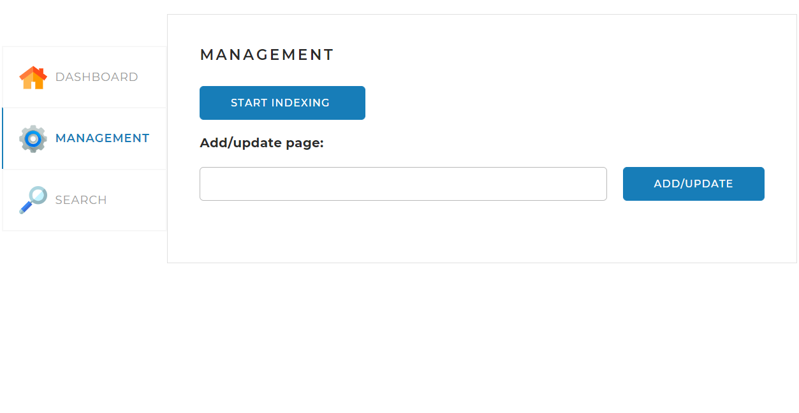
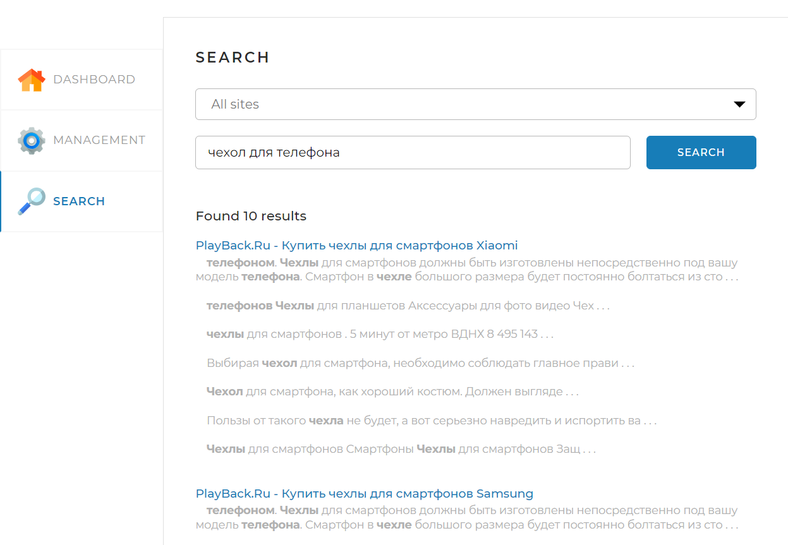
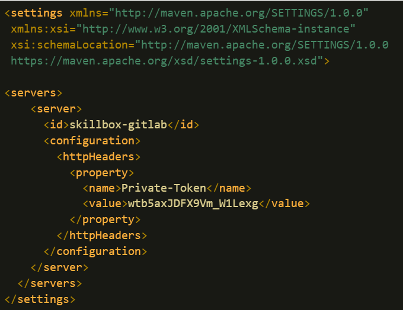

# "Поисковый движок"
## Описание
Реализована backend - составляющая часть локального поискового движка.
Поисковый движок представляет из себя Spring-приложение, работающее с локально установленной базой данных MySQL, имеющее простой веб-интерфейс и API, через который им можно управлять и получать результаты поисковой выдачи по запросу.

Адреса сайтов, по которым движок осуществляет поиск, задаются перед запуском приложения в конфигурационном файле.

Frontend-составляющая проекта представляет собой одну веб-страницу с тремя вкладками:

Dashboard. Эта вкладка открывается по умолчанию. На ней отображается общая статистика по всем сайтам, а также детальная статистика (о проиндексированных сайтах и страницах, а также леммах (начальная словарная форма слова), содержащихся на этих страницах) и статус по каждому из сайтов (статистика, получаемая по запросу /api/statistics).

Management. На этой вкладке находятся инструменты управления поисковым движком — запуск (API- запрос /api/startIndexing) и остановка (запрос /api/stopIndexing) полной индексации (переиндексации), а также возможность добавить (обновить) отдельную страницу по ссылке (API- запрос /api/indexPage):

Search. На этой странице находится поле поиска. Поиск фразы возможен на отдельно выбранном сайте или на всех проиндексированных. При нажатии на кнопку «Найти» выводятся результаты поиска (по API-запросу /api/search) в ранжированном и отсортированном виде:

## Стэк используемых технологий
Java

MySQL

Spring Boot
## Инструкция по локальному запуску проекта
Необходимо иметь установленный JDK 17 версии и выше,
и среду разработки IntelliJ IDEA.
 
Установите MySQL-сервер и создайте в нем пустую базу данных search_engine.
Параметры подключения необходимо указать в application.yaml.

Загрузите проект из Git - репозитория.

Запустите приложение и откройте его через браузер по адресу: http://localhost:8080/.

Или

скачайте JAR файл SearchEngine.jar и запустить его в консоли.

Для успешного скачивания и подключения к проекту зависимостей из GitHub необходимо настроить Maven конфигурацию в файле settings.xml.
Для доступа требуется авторизации по токену.

Для указания токена найдите или создайте файл settings.xml.

В Windows он располагается в директории

C:/Users/<Имя вашего пользователя>/.m2

В Linux — в директории

/home/<Имя вашего пользователя>/.m2

В macOs — по адресу

/Users/<Имя вашего пользователя>/.m2

Если файла settings.xml нет, создайте его и вставьте в него код:

Обязательно почистите кэш maven. Самый надёжный способ — удалить директорию:

Windows: C:\Users\<user_name>\.m2\repository
macOs: /Users/<user_name>/.m2/repository
Linux: /home/<user_name>/.m2/repository

где, <user_name> — имя пользователя, под которым вы работаете.

После этого снова попробуйте обновить данный из pom.xml.

Затем обновите зависимости в проекте при помощи <Ctrl+Shift+O> или <⌘⇧I>.

